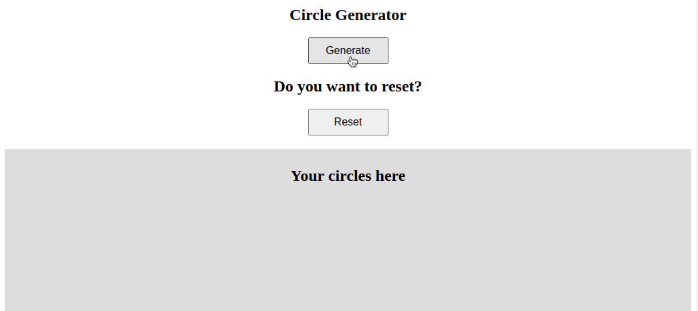

# Entrega: Circle generator

Para começar, acesse [este link](https://gitlab.com/kenzie-academy-brasil/se/fe/getting-started-with-javascript/assessment-circle-generator), faça o fork e clone o repositório.

## Introdução

No repositório clonado, foi fornecido o código HTML e CSS. Portanto, precisamos nos preocupar somente em entender o que esses códigos estão fazendo.

Nesta entrega você irá criar um gerador de circulos, veja o exemplo:



## Seu objetivo:

Organizar os códigos abaixo, de modo que seu projeto tenha o mesmo comportamente que o exemplo fornecido anteriormente.

## Início

Como os códigos HTML e CSS já estão prontos, agora é hora de partir para o JavaScript.

No exemplo acima, vimos que **ao cliclar no botão GENERATE**, novos circulos de cores diferentes são criados.

- Passo 1: Adicionar o evento de click no botão GENERATE.

```js
const buttonGenerate = document.getElementById("buttonGenerate");
buttonGenerate.addEventListener("click", () => {
  // teu código vai aqui ...
});
```

- Passo 2: Criar uma função que gera novos circulos.

```js
const createCircle = (color) => {
  const newCircle = document.createElement("div");
  newCircle.style.height = "70px";
  newCircle.style.width = "70px";
  newCircle.style.border = `solid 2px ${color}`;
  newCircle.style.borderRadius = "50%";

  return newCircle;
};
```

- Passo 3: Criar uma função escolha que cores de forma aleatória.

```js
const randomColor = () => {
  const colors = ["#1F271B", "#003F91", "#6D326D", "#157A6E", "#916953"];

  return colors[Math.floor(Math.random() * 5)];
};
```

## Resetando o HTML

No código HTML fornecido, vimos que o local de armazenamento dos circulos é a div com o id **boxStorage**. Com essa informação, fica muito simples resetar o conteúdo dessa div.

No exemplo acima, **ao clicar no botão RESET** todos os circulos somem.

- Passo 1: Adicionar o evento de click no botão RESET.

```js
const buttonReset = document.getElementById("buttonReset");
buttonReset.addEventListener("click", () => {
  // teu código vai aqui ...
});
```

- Passo 2: Resetar o conteúdo HTML dentro da div boxStorage.

```js
const boxStorage = document.getElementById("boxStorage");
boxStorage.innerHTML = "";
```

## Envio

Faça o push do código para o seu repositório GitLab e implemente-o via GitLab pages. No Canvas, por favor, envie a url de seu Gitlab Pages (ex: https://nomedeusuario.gitlab.io/circle-generator/) e, no GitLab, adicione o grupo `ka-br-<sua-turma>-correcoes` como membro do seu projeto com a permissão "Reporter".
